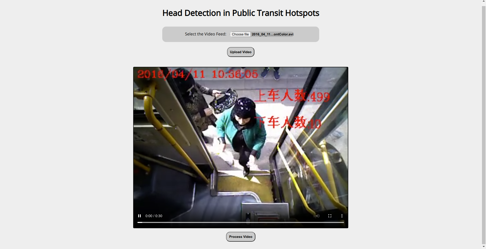
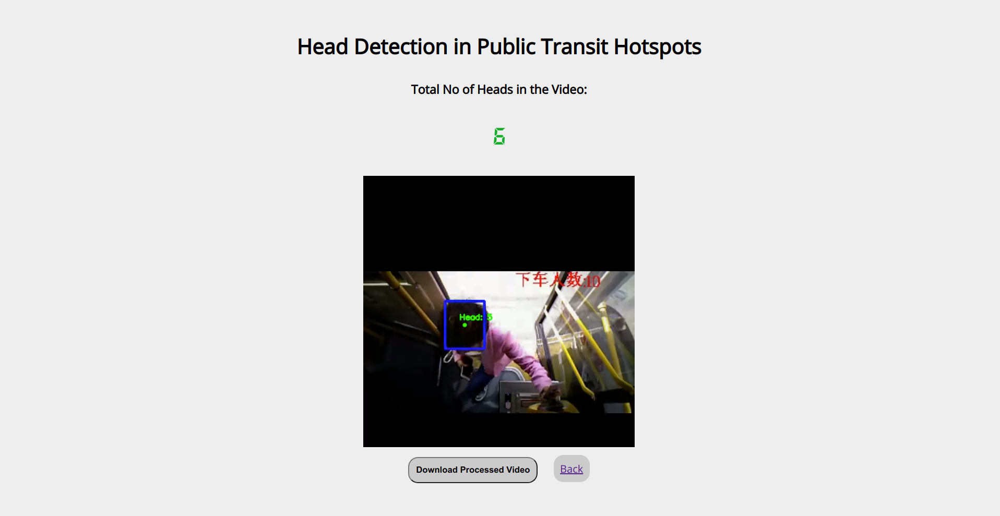

# Head Detection in Public Transit Hotspots

## Table of contents
* [About](#about)
* [Features](#features)
* [Packages Used](#packages-used)
* [Setup](#setup)
* [Usage](#usage)
* [Screenshots](#screenshots)
* [References](#references)

## About
This use case deals with the identification and counting of heads in video footage to understand the Footfall of people in a given area and automatically count the number of people entering and exiting a given location. The current implementation of the use case is specifically focused on automated ticketing systems where the number of people entering or exiting a given vehicle is monitored.

## Features
- The project utilizes Single Shot based Detectors (SSD) for Head Identification from video frames.
- The People Counting Functionality is implemented by:
    - Region of Interest Identification
    - Centroid Tracking and head Tagging

## Packages Used
- TensorFlow - 1.15.4
- Keras - 2.2.4
- FastAPI
- OpenCV
- imutils
- nest-asyncio
- pyngrok
- asgiref

## Setup

### Requirements
- Python 3.6+

### Installation
- To install required packages:<br>
```bash
pip install -r requirements.txt
```

## Usage

```bash
python main.py
```

## Screenshots

<span class="img_container center" style="display: block;">
    
    <span class="img_caption" style="display: block; text-align: center;">Video Upload UI</span>
</span><br><br>

<span class="img_container center" style="display: block;">
    
    <span class="img_caption" style="display: block; text-align: center;">Preview Uploaded Video</span>
</span><br><br>

<span class="img_container center" style="display: block;">
    
    <span class="img_caption" style="display: block; text-align: center;">View Detected Heads and Total Count</span>
</span><br><br>

## References
- <https://github.com/AVAuco/ssd_head_keras>
- <https://github.com/shijieS/people-counting-dataset>
- <https://www.pyimagesearch.com/2018/07/23/simple-object-tracking-with-opencv/>

